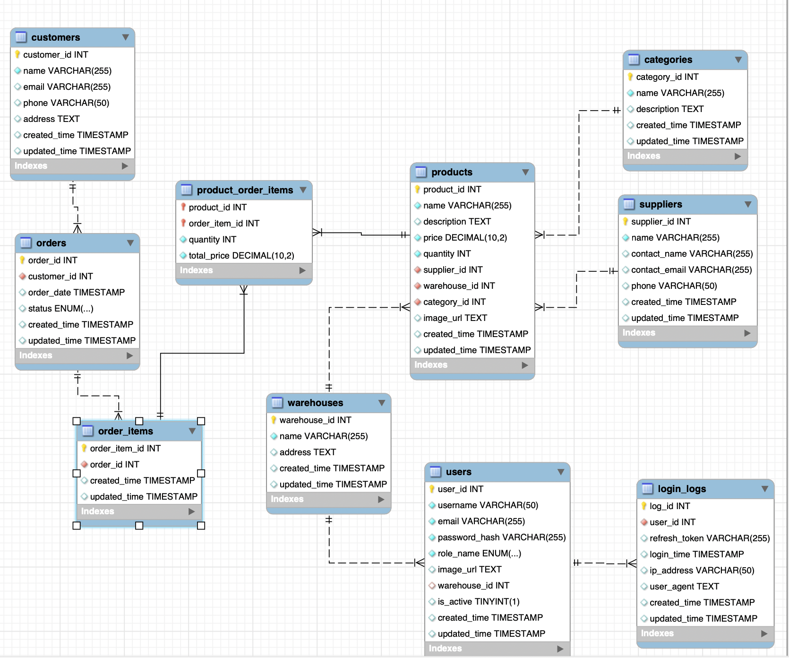

# 📌 Inventory Management System for Database Course

## 📄 Brief Description

The **Inventory Management System** is a full-stack web application built to streamline the tracking and management of stock, suppliers, and transactions for small to medium-sized businesses. It is developed as a final project for a university **Database Systems** course, showcasing solid relational database design, SQL programming (views, triggers, procedures), and integration with real-world tech tools.

This system solves the common issue of fragmented inventory records and manual errors by providing centralized, consistent, and real-time inventory control. It also extends traditional relational database capabilities with support for object storage (images, files) via **MinIO**.

---

## 🎯 Functional & Non-functional Requirements

### ✅ Functional Requirements

- User authentication with role-based access (Admin, Manager, Staff)
- Full CRUD operations for:
  - Products
  - Suppliers
  - Orders and inventory transactions
- Stock movement logging (inbound/outbound)
- Inventory threshold alerts (e.g., low stock)
- Document and image uploads (e.g., product photos, receipts)
- Reporting: inventory summaries, stock usage history
- Export reports as CSV or PDF
- Audit log for changes (trigger-based)

### ⚙️ Non-functional Requirements

- Fully normalized schema (to at least 3NF)
- Fast API responses with caching (Redis)
- Secure authentication (JWT, hashed passwords)
- ACID-compliant transactions
- Indexed queries for optimized performance
- Modular and containerized architecture (Docker-based)
- Responsive and intuitive UI (Next.js)
- CI/CD-enabled development workflow

---

## 🧱 Database Schema



This document outlines the database schema for an Inventory Management System, designed to manage products, orders, users, and related entities. The schema is implemented in SQL and includes tables with their respective fields and purposes.

### Warehouse

**Purpose**: Represents physical places where products are stored (e.g., warehouses).

| Field           | Type                  | Description                                      |
|-----------------|-----------------------|--------------------------------------------------|
| `warehouse_id`  | INT (PK, AI)          | Unique identifier for the warehouse              |
| `name`          | VARCHAR(255)          | Name of the warehouse (e.g., "Main Warehouse")   |
| `address`       | TEXT                  | Physical address of the warehouse                |
| `created_time`  | TIMESTAMP             | Record creation timestamp (default: CURRENT_TIMESTAMP) |
| `updated_time`  | TIMESTAMP             | Record update timestamp (default: CURRENT_TIMESTAMP, updates on change) |

### User

**Purpose**: Represents authenticated system users with role information (e.g., admin, staff).

| Field           | Type                  | Description                                      |
|-----------------|-----------------------|--------------------------------------------------|
| `user_id`       | INT (PK, AI)          | Unique identifier for the user                   |
| `username`      | VARCHAR(50)           | User's username                                  |
| `email`         | VARCHAR(255), UNIQUE  | User's email address                             |
| `password_hash` | VARCHAR(255)          | Hashed password for authentication               |
| `role_name`     | ENUM('admin', 'staff')| User's role (admin or staff)                     |
| `image_url`     | TEXT                  | URL to the user's avatar image                   |
| `warehouse_id`  | INT (FK)              | References `warehouses(warehouse_id)`            |
| `is_active`     | BOOLEAN               | Indicates if the user account is active          |
| `created_time`  | TIMESTAMP             | Record creation timestamp (default: CURRENT_TIMESTAMP) |
| `updated_time`  | TIMESTAMP             | Record update timestamp (default: CURRENT_TIMESTAMP, updates on change) |

### LoginLog

**Purpose**: Tracks user login attempts for security and auditing.

| Field           | Type                  | Description                                      |
|-----------------|-----------------------|--------------------------------------------------|
| `log_id`        | INT (PK, AI)          | Unique identifier for the login log              |
| `user_id`       | INT (FK)              | References `users(user_id)`                      |
| `refresh_token` | VARCHAR(255)          | Token used for session management                |
| `login_time`    | TIMESTAMP             | Timestamp of the login attempt (default: CURRENT_TIMESTAMP) |
| `ip_address`    | VARCHAR(50)           | IP address of the login attempt                  |
| `user_agent`    | TEXT                  | User agent string of the client device           |
| `created_time`  | TIMESTAMP             | Record creation timestamp (default: CURRENT_TIMESTAMP) |
| `updated_time`  | TIMESTAMP             | Record update timestamp (default: CURRENT_TIMESTAMP, updates on change) |

### Supplier

**Purpose**: Represents sources of goods and stock for the inventory.

| Field           | Type                  | Description                                      |
|-----------------|-----------------------|--------------------------------------------------|
| `supplier_id`   | INT (PK, AI)          | Unique identifier for the supplier               |
| `name`          | VARCHAR(255)          | Name of the supplier                             |
| `contact_name`  | VARCHAR(255)          | Contact person’s name                            |
| `contact_email` | VARCHAR(255)          | Contact email address                            |
| `phone`         | VARCHAR(50)           | Contact phone number                             |
| `created_time`  | TIMESTAMP             | Record creation timestamp (default: CURRENT_TIMESTAMP) |
| `updated_time`  | TIMESTAMP             | Record update timestamp (default: CURRENT_TIMESTAMP, updates on change) |

### Category

**Purpose**: Provides logical groupings for products (e.g., Electronics, Clothing).

| Field           | Type                  | Description                                      |
|-----------------|-----------------------|--------------------------------------------------|
| `category_id`   | INT (PK, AI)          | Unique identifier for the category               |
| `name`          | VARCHAR(255)          | Name of the category                             |
| `description`   | TEXT                  | Description of the category                      |
| `created_time`  | TIMESTAMP             | Record creation timestamp (default: CURRENT_TIMESTAMP) |
| `updated_time`  | TIMESTAMP             | Record update timestamp (default: CURRENT_TIMESTAMP, updates on change) |

### Product

**Purpose**: Represents core inventory items, including stock quantities and image references.

| Field           | Type                  | Description                                      |
|-----------------|-----------------------|--------------------------------------------------|
| `product_id`    | INT (PK, AI)          | Unique identifier for the product                |
| `name`          | VARCHAR(255)          | Name of the product                              |
| `description`   | TEXT                  | Description of the product                       |
| `price`         | DECIMAL(10,2)         | Price per unit of the product                    |
| `quantity`      | INT                   | Number of product units in stock at the warehouse|
| `supplier_id`   | INT (FK)              | References `suppliers(supplier_id)`              |
| `warehouse_id`  | INT (FK)              | References `warehouses(warehouse_id)`            |
| `category_id`   | INT (FK)              | References `categories(category_id)`             |
| `image_url`     | TEXT                  | URL to the product image                         |
| `created_time`  | TIMESTAMP             | Record creation timestamp (default: CURRENT_TIMESTAMP) |
| `updated_time`  | TIMESTAMP             | Record update timestamp (default: CURRENT_TIMESTAMP, updates on change) |

### Customer

**Purpose**: Represents end-users or clients for whom products are sold.

| Field           | Type                  | Description                                      |
|-----------------|-----------------------|--------------------------------------------------|
| `customer_id`   | INT (PK, AI)          | Unique identifier for the customer               |
| `name`          | VARCHAR(255)          | Customer’s full name                             |
| `email`         | VARCHAR(255)          | Customer’s email address                         |
| `phone`         | VARCHAR(50)           | Customer’s phone number                          |
| `address`       | TEXT                  | Customer’s address                               |
| `created_time`  | TIMESTAMP             | Record creation timestamp (default: CURRENT_TIMESTAMP) |
| `updated_time`  | TIMESTAMP             | Record update timestamp (default: CURRENT_TIMESTAMP, updates on change) |

### Order

**Purpose**: Represents inventory transactions, such as customer orders.

| Field           | Type                  | Description                                      |
|-----------------|-----------------------|--------------------------------------------------|
| `order_id`      | INT (PK, AI)          | Unique identifier for the order                  |
| `customer_id`   | INT (FK)              | References `customers(customer_id)`              |
| `order_date`    | TIMESTAMP             | Date and time the order was placed (default: CURRENT_TIMESTAMP) |
| `status`        | ENUM('pending', 'completed', 'cancelled') | Status of the order                   |
| `created_time`  | TIMESTAMP             | Record creation timestamp (default: CURRENT_TIMESTAMP) |
| `updated_time`  | TIMESTAMP             | Record update timestamp (default: CURRENT_TIMESTAMP, updates on change) |

### OrderItem

**Purpose**: Represents individual line items within an order, linking to products.

| Field           | Type                  | Description                                      |
|-----------------|-----------------------|--------------------------------------------------|
| `order_item_id` | INT (PK, AI)          | Unique identifier for the order item             |
| `order_id`      | INT (FK)              | References `orders(order_id)`                    |
| `created_time`  | TIMESTAMP             | Record creation timestamp (default: CURRENT_TIMESTAMP) |
| `updated_time`  | TIMESTAMP             | Record update timestamp (default: CURRENT_TIMESTAMP, updates on change) |

### ProductOrderItem

**Purpose**: Manages the relationship between order items and products, including quantities and pricing.

| Field           | Type                  | Description                                      |
|-----------------|-----------------------|--------------------------------------------------|
| `product_id`    | INT (FK)              | References `products(product_id)`                |
| `order_item_id` | INT (FK)              | References `order_items(order_item_id)`          |
| `quantity`      | INT                   | Number of product units in the order item        |
| `total_price`   | DECIMAL(10,2)         | Total price for this line item (quantity * price)|
| **Primary Key** | `(product_id, order_item_id)` | Composite key ensuring unique product-order item pairs |

## Notes

- **Primary Keys (PK)**: Most tables use an auto-incrementing `INT` as the primary key. `product_order_items` uses a composite primary key (`product_id`, `order_item_id`).
- **Foreign Keys (FK)**: Enforce referential integrity (e.g., `warehouse_id` in `users` references `warehouses`).
- **Timestamps**: `created_time` and `updated_time` are included in all tables for auditing.
- **ENUMs**: Used for fields with fixed values (e.g., `role_name` in `users`, `status` in `orders`).
- **Image URLs**: The `image_url` fields in `products` and `users` reference avatar or product images, typically hosted externally (e.g., DiceBear for avatars).
- **One-to-One Category Relationship**: Each product is assigned to one category via `category_id` in the `products` table.
- **Inventory Tracking**: The `products` table tracks stock levels directly via the `quantity` field, associated with a specific warehouse.
- **Order Structure**: The `order_items` table links orders to products through `product_order_items`, allowing multiple products per order item with specified quantities and prices.

This schema supports a robust inventory management system with user authentication, product categorization, stock tracking, and order processing.

---

## 🔧 Tech Stack

- **Backend**: [FastAPI](https://fastapi.tiangolo.com/) (Python), RESTful API
- **Databases**:
  - **MySQL**: Core relational data (normalized schema, foreign keys, procedures, views)
  - **Redis**: Caching, pub/sub for real-time UI sync
  - **MinIO**: Object storage for files (e.g., product images, invoices, reports)
- **Frontend**: [Next.js](https://nextjs.org/) (React-based frontend)
- **Authentication**: JWT (JSON Web Tokens)
- **Validation**: Pydantic (FastAPI schema validation)
- **Deployment**: Docker, Docker Compose, Nginx-Proxy-Manager (reverse proxy), Portainer (container management)
- **CI/CD**: GitHub Actions for testing and deployment automation

---

## 👥 Team Members and Roles

| Name                | Role                                 |
|---------------------|--------------------------------------|
| Nguyen Xuan Truong  | Software developer                   |
| Le Ngoc Toan        | Software Developer                   |

---

## 📅 Timeline (Planned Milestones)

| Milestone                                       | Target Date    |
|--------------------------------------------------|----------------|
| ✅ Topic Approval & Team Registration             | May 6, 2025    |
| 📐 ER Diagram & Relational Schema Design          | May 10, 2025   |
| 🛠️ DDL Implementation (MySQL: Tables, FK, Indexes) | May 13, 2025   |
| 🔁 Triggers, Stored Procedures & Views            | May 16, 2025   |
| 🧪 Test Data Insertion & SQL Queries              | May 18, 2025   |
| 🔧 Backend API (FastAPI + Redis + MinIO)          | May 20, 2025   |
| 💻 Frontend UI (Next.js + API Integration)        | May 23, 2025   |
| 📊 Reporting Features (export to CSV/PDF)         | May 25, 2025   |
| 🚀 Final Submission, Demo, and Report             | May 27, 2025   |

---

> 🧠 This project integrates relational databases, object storage, caching, and modern web development to meet the educational objectives of the Database Systems course while solving a real-world business problem.

## 📜 How to run this

### Prerequisites

Make sure you have the following installed:

- Docker [https://docs.docker.com/get-docker/]
- Docker Compose [https://docs.docker.com/compose/install/]
- make (if you are using Windows, you can use WSL2 to install make or use the make command in Git Bash) [https://www.gnu.org/software/make/]

### Steps to run the project

1. Clone the repository:

    ```bash
   git clone git@github.com:truongng201/Database-IMS-Project.git
    cd Database-IMS-Project
    ```

2. Add your environment variables in the `.env` file. You can use the `.template.env` file as a template.

3. Build and run the services:

  ```bash
      # Make sure in the root directory of the project and down all the services first
    make services-down # To stop all the services then you can run the services normally
      # To build the services
    make services-up SERVICE='product' # To run the product service
      # or
    make services-up SERVICE='product order' # To run the product and order services

    make services-down # To stop the services

      # To run client service
    make client-dev # To run the client service
    make client-build # To build the client service
    make client-start # To run the client service in build mode

      # To run the all service
    make all # To run all services
  ```

## 🖥️ Accessing the Application 

1. Access the application:
    - Frontend: [http://localhost:3000](http://localhost:3000)
    - Services: formatted as: <http://localhost:8080/v1/{service_name}>
      - For example:
        - Product: [http://localhost:8080/v1/product](http://localhost:8080/v1/product)
        - Order: [http://localhost:8080/v1/order](http://localhost:8080/v1/order)
    - MinIO: [http://localhost:9001](http://localhost:9001) (Console address with credentials from `.env`)
    - MySQL Workbench or any other MySQL client to connect to the database.

2. Access from the production environment:
    - Frontend: [https://vinuni-database-ims.duckdns.org](https://vinuni-database-ims.duckdns.org)
    - Services: formatted as: <https://api.vinuni-database-ims.duckdns.org/v1/{service_name}>
      - For example:
        - Product: [https://api.vinuni-database-ims.duckdns.org/v1/product](https://api.vinuni-database-ims.duckdns.org/v1/product)
        - Order: [https://api.vinuni-database-ims.duckdns.org/v1/order](https://api.vinuni-database-ims.duckdns.org/v1/order)
      - You can follow the health check of the services at - Product: [https://api.vinuni-database-ims.duckdns.org/v1/product/health](https://api.vinuni-database-ims.duckdns.org/v1/product/health).
        - The response should be like this - the version here is the commit hash of the last commit that was pushed to the main branch.

        ```json
        {
          "status": "success",
          "data": "product service is running with version d188e5be017ac569fdfd6894cd76bfed9ff02ac3",
          "message": "Operation completed successfully"
        }
        ```
      - You can get the api documentation at - Product: [https://api.vinuni-database-ims.duckdns.org/v1/user/docs](https://api.vinuni-database-ims.duckdns.org/v1/user/docs).
        - The documentation is generated by FastAPI and you can use it to test the API. It mentions all the endpoints and the request and response models.
        - Each service has its own documentation, so you can access the documentation of each service by replacing the service name in the URL.
        - Here how it looks like:
        


    - MinIO: [https://minio.vinuni-database-ims.duckdns.org](https://minio.vinuni-database-ims.duckdns.org) (Ask the team for credentials)
    - Portainer: [https://portainer.vinuni-database-ims.duckdns.org](https://portainer.vinuni-database-ims.duckdns.org) (Ask the team for credentials)
    - ProxyManager: [https://proxy-manager.vinuni-database-ims.duckdns.org](https://proxy-manager.vinuni-database-ims.duckdns.org) (Ask the team for credentials)

## 📜 Architecture

